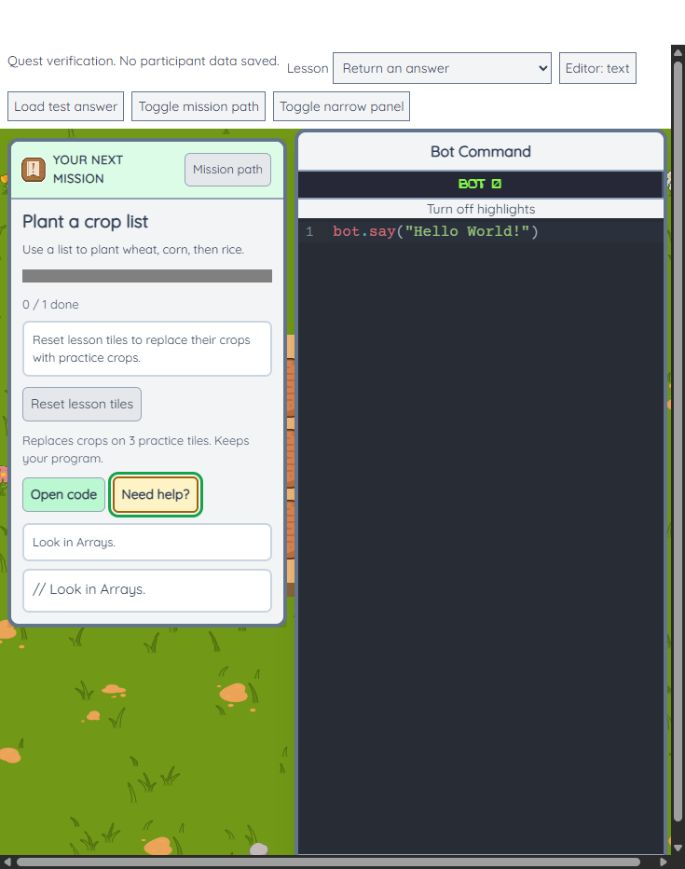

# Quest path v2 UI review

Mode: after, selected for this session. Scope: the new quest text, hint flow,
practice controls, and optional-quest controls. Existing unrelated menus and
their build warnings are outside this review.

Direction: preserve the existing slate-framed, light game panels, green action
buttons, Quicksand text, and game artwork. ENERGY 2 / RHYTHM 2 / MOTION 2.
The current mission remains the focal point. Hints and setup messages use the
existing bordered instruction style so they remain readable beside the editor.
Category flashes point to the requested toolbox area and honor reduced motion.
No new artwork, palette, fonts, decorative sections, or marketing claims.

## Findings

No additional actionable findings in the changed quest UI.

## Delivery checks

- Hard gate PASS: the 300px mission panel measured 300px with no horizontal
  overflow. Keyboard Enter activated hints, setup, execution, reward collection,
  optional practice, and returning to the main path. Focus was visible.
- Purpose gate PASS: green marks actions, bordered text separates help from the
  goal, and the yellow code line identifies the missing step. Existing styles
  are reused rather than adding unrelated decoration.
- Liveliness PASS: the existing mission transition and block-placement motion
  remain; the selected quest title leads the panel and help stays subordinate.
  Reduced-motion handling remains in the guide and category cue.
- Craftsmanship PASS: variable and cleanup quests completed in Blockly;
  function-parameter and fire-patrol quests completed in text mode. Collecting
  the cleanup reward advanced to the row-count lesson. Optional return-value
  practice returned to the required list lesson.
- Copy PASS: goals use short instructions, progress says “done,” and the idle
  offer reads “Stuck? That's normal here. Want a small hint?” Hints progress from
  category to block, incomplete program, then answer and explanation.
- Verification PASS: 304 automated tests passed. Every concept answer runs in
  the bundled interpreter as text and Blockly-generated JavaScript. The
  production build passed; its existing unrelated accessibility and bundle-size
  warnings remain.

Browser security checks intermittently timed out, then succeeded on retry.
The review makes no claim about a full mobile redesign or new student outcomes.

