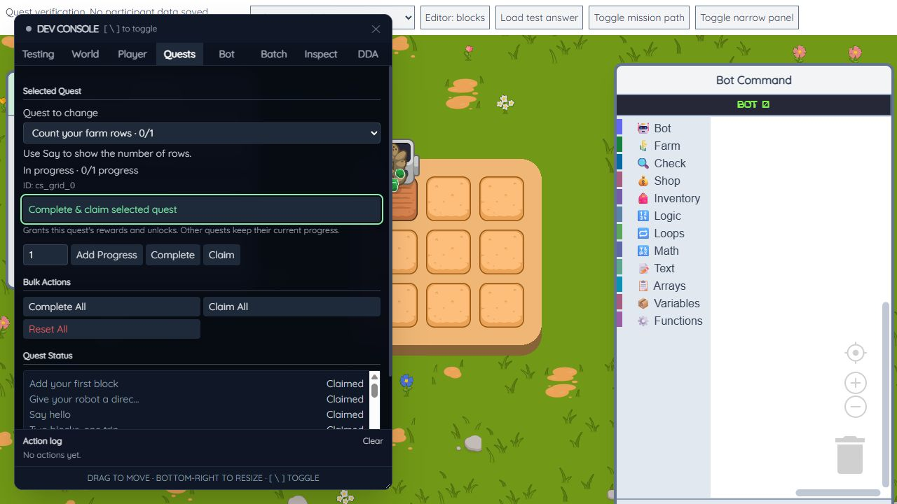

# Developer quest selector review

Mode: after (session choice). Scope: the changed quest selector and action row.
Direction: retain the existing compact dark developer console, native controls,
and green action accent. ENERGY 1 / RHYTHM 1 / MOTION 1. The selected quest and
its combined action lead; separate progress tools and bulk actions stay below.

## Findings

No actionable findings in the changed controls.

## Delivery checks

- Hard gate PASS: the selector has a visible associated label, options include
  chapter and status, and the progress input has an accessible name. Keyboard
  selection, Tab, and Enter were exercised in the running fixture. Pending and
  already-claimed states disable the combined action; errors use the action log.
- Purpose gate PASS: the existing green accent identifies the combined action;
  no new imagery, fonts, decorative sections, or motion were added.
- Liveliness PASS: the selected quest is the focal point; details and grouped
  options reflect actual quest data and update immediately after actions.
- Craftsmanship PASS: browser checks completed and claimed the required cleanup
  quest, added two progress to the optional corn quest, then completed and
  claimed it. Both showed successful logs and disabled repeat claiming. Other
  quests retained their progress. The existing console layout remains intact
  at the inspected desktop size; this review does not claim a mobile redesign.
- Verification PASS: all 306 automated tests and the production build passed.
  The browser fixture now mounts PlayerInfo so reward updates have the same
  required HUD elements as the game.

