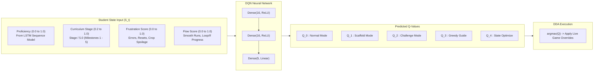

# Algobot Machine Learning Pipeline Documentation

This document provides complete architectural, mathematical, technical, and operational documentation for the Algobot ML Pipeline.

---

## 1. Research Methodology & Architecture Overview

### Core Research Principle
> "The game is not waiting for an ML model. The game is the mechanism that creates the ML model."

To solve the **cold-start problem** (absence of prior student training data) without altering the approved **RNN + DQN + Dynamic Difficulty Adjustment (DDA)** architecture or changing core game mechanics, the system implements a phased 3-stage lifecycle:

```
┌──────────────────────────────────────────────────────────────┐
│                  VERSION 1: BOOTSTRAP PHASE                  │
│                                                              │
│  Student plays → Telemetry (10 features) → Bootstrap DDA     │
│                      │                           │           │
│                      ▼                           ▼           │
│              Raw Event Log               Experience Tuples   │
│            + Feature Snapshots            (s, a, r, s', done) │
│            + Proficiency Labels                  │           │
│                      │                           │           │
│                      └─────────────┬─────────────┘           │
│                                    ▼                         │
│                           Dataset Export (JSON/CSV)          │
├──────────────────────────────────────────────────────────────┤
│                  OFFLINE MODEL DEVELOPMENT                   │
│                                                              │
│  Dataset → Preprocessing & Normalization                     │
│               ├─ Train LSTM (Proficiency Predictor)          │
│               └─ Train DQN (Action Policy)                   │
│                       │                                      │
│                       ▼                                      │
│             Export TensorFlow.js Models                      │
├──────────────────────────────────────────────────────────────┤
│                  VERSION 2: ADAPTIVE DEPLOYMENT              │
│                                                              │
│  Student plays → Telemetry → Pretrained LSTM predicts score  │
│                                        │                     │
│                                        ▼                     │
│                              Pretrained DQN selects action   │
│                                        │                     │
│                                        ▼                     │
│                              DDA adapts difficulty           │
└──────────────────────────────────────────────────────────────┘
```

---

## 2. Machine Learning Task Definitions

### A. LSTM Proficiency Encoder
* **Prediction Target**: Continuous **Student Proficiency Score** *p* in range [0.0, 1.0].
  * **0.0 – 0.3**: Beginner (struggling with Logic Wall; requires scaffolding)
  * **0.3 – 0.6**: Intermediate (developing algorithmic competency)
  * **0.6 – 1.0**: Advanced (proficient; ready for additional challenge)
* **Automatic Label Generation Formula**:
  ```
  Proficiency = 0.40 * C + 0.25 * (1 - E) + 0.20 * (1 - R) + 0.15 * (1 - H)
  ```
  Where:
  * **C** (Completion Score): Quest completion ratio (0.0 to 1.0)
  * **E** (Error Penalty): `min(1.0, errorsThisQuest / 10)`
  * **R** (Retry Penalty): `min(1.0, resetsThisQuest / 5)`
  * **H** (Hint Penalty): `min(1.0, hintsUsed / 5)`
* **Input Window**: Tensor of shape **`[20, 10]`** (20-timestep sliding window of 10 telemetry features, zero-padded at session start).
* **Loss Function & Metrics**: Mean Squared Error (MSE), evaluated using RMSE, MAE, R², and compared against a Naïve Mean Predictor baseline.

### B. Telemetry Feature Vector (10 Channels)
1. **Error Rate**: `min(1.0, errors / 10)`
2. **Execution Speed**: `min(1.0, stepsPerMin / 200)`
3. **Iteration Usage**: `min(1.0, (forLoops + whileLoops) / 5)`
4. **Condition Reactivity**: `min(1.0, ifEvaluations / 10)`
5. **Greedy Priority Efficiency**: `optimalHarvests / totalHarvests`
6. **Yield Quality Ratio**: `freshHarvests / totalHarvests`
7. **Frustration Score**: Composite error/reset score (0.0 to 1.0)
8. **Code Execution Success Rate**: `successfulRuns / totalRuns`
9. **Hint Consumption Rate**: `min(1.0, hintsShown / 10)`
10. **Completion Time Ratio**: `elapsedTime / expectedStageTime`

> **Editor Mode**: Blockly vs. Text editor mode is tracked as session metadata for qualitative research, but excluded from the ML feature vector because mode selection does not directly correlate with algorithmic proficiency.

### C. Deep Q-Network (DQN) Action Policy & Value Dynamics

#### 1. What are Q-Values?
In the Algobot DDA system, **Q-values** represent the expected long-term *pedagogical reward* of taking a specific dynamic difficulty adjustment (DDA) action given the student's current learning and emotional state.

When the agent runs inference, the DQN receives a 4-dimensional state vector and outputs an array of **5 real numbers (Q-values)**:
```
Q-Values = [ Q_0, Q_1, Q_2, Q_3, Q_4 ]
```
Each number corresponds to one of the 5 discrete DDA actions. In deployed ML Mode, the agent uses a **greedy policy** ($\epsilon = 0.0$), selecting whichever action currently has the highest Q-value:
```javascript
const selectedAction = qValues.indexOf(Math.max(...qValues));
```



---

#### 2. The 4 State Vector Inputs (What Directly Changes Q-Values)

The DQN does not evaluate actions in isolation; its predicted Q-values shift continuously based on 4 telemetry variables:

| State Feature | Range | Mathematical Source | What Drives It UP (↑) | What Drives It DOWN (↓) |
| :--- | :---: | :--- | :--- | :--- |
| **1. Student Proficiency** | `0.0 - 1.0` | Output by LSTM model over the last 20 timesteps | Successful quest completions, low error frequency, few code resets, zero hints used | Execution order errors (e.g. planting before tilling), code crashes, repeated code resets |
| **2. CS1 Stage** | `0.2 - 1.0` | `currentStage / 5.0` | Progressing from Stage 1 (Sequential) up to Stage 5 (State Optimization) | Remains static within a milestone |
| **3. Frustration Score** | `0.0 - 1.0` | Composite event thresholding in `telemetry.js` | `+0.3` if recent errors > 5<br/>`+0.3` if code resets > 3<br/>`+0.3` if crop spoilage rate > 40% | Solving quests without resets, avoiding syntax/order errors, harvesting crops fresh |
| **4. Flow Score** | `0.0 - 1.0` | Positive reinforcement accumulator in `telemetry.js` | `+0.15` for sequential farming chains<br/>`+0.15` for `if` checks<br/>`+0.15` for loop completions | `-0.30` penalty whenever Frustration Score exceeds 0.5 |

---

#### 3. The 5 DDA Actions & Live In-Game Mechanics Overrides

When a specific action has the highest Q-value, [`dda.js`](file:///c:/Users/ADMIN/Documents/algobot-latest/src/game/ml/dda.js) immediately modifies the game parameters:

| Action ID & Name | Growth Speed | Spoilage Window | Pest / Fire Spawns | Injected In-Game Tip |
| :--- | :---: | :---: | :---: | :--- |
| **`0: NORMAL`**<br/>(Baseline Mode) | `1.0x` (default) | `1.0x` (default) | `1.0x` (default) | *(No active tip)* |
| **`1: SCAFFOLD`**<br/>(Logic Wall Helper) | **`0.7x`**<br/>*(30% faster)* | **`1.5x`**<br/>*(50% longer)* | **`0.3x`**<br/>*(70% fewer)* | *"Tip: Order matters! Make sure to till the soil before planting seeds."* |
| **`2: CHALLENGE`**<br/>(High Skill Engagement) | `1.0x` | **`0.8x`**<br/>*(20% faster)* | **`1.5x`**<br/>*(50% more)* | *"Challenge Active: Pests and spoilage are faster! Can you automate with a loop?"* |
| **`3: GREEDY_GUIDE`**<br/>(Algorithmic Tutor) | `1.0x` | **`1.2x`**<br/>*(20% longer)* | `1.0x` | *"Greedy Choice Tip: Always inspect crops and harvest the one closest to spoiling first!"* |
| **`4: STATE_OPTIMIZE`**<br/>(Stochastic Planner) | **`0.9x`**<br/>*(10% faster)* | **`1.1x`**<br/>*(10% longer)* | **`1.2x`**<br/>*(20% more)* | *"State Strategy Tip: Prepare for unexpected pests by checking crop status inside loops!"* |

---

#### 4. The Pedagogical Reward Function (How the Model Was Trained)

During offline reinforcement learning with [`train_dqn.py`](file:///c:/Users/ADMIN/Documents/algobot-latest/training/train_dqn.py), the network learned which action yields the highest reward using the following formulation:

$$\text{Reward } R = 2.0 \cdot \Delta\text{Flow} - 2.0 \cdot \Delta\text{Frustration} + R_{\text{quest}} - P_{\text{misaligned}}$$

```
Reward = (ΔFlow * 2.0) - (ΔFrustration * 2.0) + QuestBonus - ScaffoldPenalty - ChallengePenalty
```

Where:
* **$\Delta\text{Flow} = \text{Flow}_{t+1} - \text{Flow}_t$**: Encourages the model to choose actions that help the student enter and sustain a flow state.
* **$\Delta\text{Frustration} = \text{Frustration}_{t+1} - \text{Frustration}_t$**: Strong negative feedback if an action causes frustration to increase; positive feedback when frustration drops.
* **Quest Bonus ($+1.0$)**: Awarded when an action is associated with successful quest completion.
* **Inappropriate Scaffold Penalty ($-0.5$)**: Penalizes the model if it triggers `SCAFFOLD` when the player is already proficient ($\text{Proficiency} > 0.7$), preventing patronizing assistance.
* **Inappropriate Challenge Penalty ($-0.5$)**: Penalizes the model if it triggers `CHALLENGE` when the player is struggling ($\text{Proficiency} < 0.3$), preventing cognitive overload.

---

#### 5. Step-by-Step Gameplay Scenarios: How Q-Values Shift

##### Scenario A: Student Hits the "Logic Wall" (Struggling with Sequential Order)
1. **Student Action**: The student attempts to plant seeds on untilled soil 4 times, triggering order errors, and repeatedly clicks the "Reset Code" button.
2. **Telemetry Updates**:
   - `errors` rises $> 5$, `resets` rises $> 3$.
   - $\text{FrustrationScore} \to 0.60$, $\text{FlowScore} \to 0.20$.
   - LSTM encodes the sliding window of failures $\to \text{Proficiency} \to 0.18$.
3. **DQN Response**:
   - State Vector: $[0.18, 0.20, 0.60, 0.20]$.
   - The trained network predicts **$Q_1$ (`SCAFFOLD`) as the maximum Q-value** (e.g. $Q_1 = +0.85$, whereas $Q_2 = -1.20$).
4. **Game Result**:
   - The DDA applies `SCAFFOLD`: Crop spoilage is relaxed by $+50\%$, pests drop by $-70\%$, and a gentle hint appears reminding the student to till before planting.

##### Scenario B: Student Masters Loops & Achieves Flow
1. **Student Action**: The student writes an efficient `for` loop that tills, plants, and waters a full $3 \times 3$ plot in a single execution with zero errors.
2. **Telemetry Updates**:
   - `forLoopExecutions` increases, `cropsHarvestedFresh` rises steadily.
   - $\text{FrustrationScore} \to 0.0$, $\text{FlowScore} \to 0.85$.
   - LSTM encodes continuous clean actions $\to \text{Proficiency} \to 0.92$.
3. **DQN Response**:
   - State Vector: $[0.92, 0.60, 0.00, 0.85]$.
   - The trained network predicts **$Q_2$ (`CHALLENGE`) or $Q_0$ (`NORMAL`) as the highest Q-value** ($Q_2 = +0.78$).
4. **Game Result**:
   - The DDA applies `CHALLENGE`: Crop spoilage accelerates by $20\%$ and pest spawns increase by $50\%$, prompting the student to optimize their automation loop.

---

## 3. Machine Learning & DDA Modules Breakdown

This section details the roles, responsibilities, and key mechanisms of each file in the Machine Learning and Dynamic Difficulty Adjustment pipeline.

### A. Telemetry & Data Infrastructure

#### `src/game/ml/telemetry.js` — Real-Time Telemetry Tracker
* **Role**: Primary telemetry engine for real-time behavior tracking.
* **Responsibilities**:
  * Captures real-time student actions across the 5 CS1 curriculum milestones.
  * Maintains an in-memory sliding window history buffer `[20, 10]` representing recent temporal behaviors.
  * Calculates real-time emotional indices: **Frustration Score** (based on error density, resets, and crop spoilage) and **Flow Score** (based on sustained successful executions and milestone progression).
  * Generates continuous ground-truth proficiency labels automatically upon quest completion.
  * Logs an immutable, append-only raw event stream (`rawEvents`) for fine-grained re-analysis.
  * Assigns session UUIDs and anonymous participant identifiers (`Participant_001`, `Participant_002`, etc.).

#### `src/game/ml/data-logger.js` — Session Data Logger & Exporter
* **Role**: Data persistence and export manager bridging browser telemetry to the offline Python training pipeline.
* **Responsibilities**:
  * Periodically auto-saves session state to browser `localStorage`.
  * Manages dataset versioning (e.g., `dataset_v1`, `dataset_v2`) to ensure reproducibility.
  * Provides export utility functions:
    * **Full Session JSON**: Complete session export including raw event logs, feature time-series, and quest attempts.
    * **Quest Attempt CSV**: Flattened tabular export designed for tabular ML preprocessing.
    * **Replay Buffer JSON**: Experience tuples `(s, a, r, s', done)` for offline DQN training.

#### `src/game/global/interpreter.js` — Code Interpreter Integration
* **Role**: Hooks code execution steps inside the JS-Interpreter to telemetry metrics.
* **Responsibilities**:
  * Exposes native functions `__trackLoop` and `__trackIf` to monitor loop iterations and conditional evaluations inside student scripts.
  * Evaluates greedy harvest decisions dynamically inside `bot.harvest` by comparing the spoilage timer of the harvested crop against all other harvestable crops on the farm grid.

---

### B. Adaptive DDA & Agent Execution Layer

#### `src/game/ml/agent.js` — Central ML Agent Manager
* **Role**: Primary decision controller coordinating model inference and DDA mode execution.
* **Responsibilities**:
  * Manages dual-mode execution:
    * **Bootstrap Mode**: Bypasses neural network outputs and uses deterministic rule-based logic while building experience replay buffers.
    * **ML Mode**: Loads pre-trained TensorFlow.js models (`/models/lstm/model.json` and `/models/dqn/model.json`) for active forward pass inference.
  * Auto-detects model availability at startup without requiring manual mode configuration.
  * Manages the in-memory experience replay buffer and persists it to `localStorage`.
  * Computes temporal difference reward values based on flow gain, frustration reduction, and quest completion bonuses.

#### `src/game/ml/dda-bootstrap.js` — Deterministic Bootstrap Controller
* **Role**: Handcrafted adaptive controller used during Version 1 data collection.
* **Responsibilities**:
  * Evaluates rule-based thresholds on telemetry states (e.g., high frustration → `SCAFFOLD`, high flow → `CHALLENGE`, suboptimal stage 4 harvests → `GREEDY_GUIDE`).
  * Emits identical 5-action output structures as the DQN to ensure consistent experience tuple formatting for subsequent RL training.

#### `src/game/ml/dda.js` — Dynamic Difficulty Adjustment Controller
* **Role**: Mechanics modifier executing selected DDA actions inside the game loop.
* **Responsibilities**:
  * Overrides `CROP_DATA` properties dynamically (`growthMultiplier`, `spoilageMultiplier`).
  * Sets pest and fire event spawn frequency multipliers (`bugSpawnMultiplier`, `fireSpawnMultiplier`).
  * Injects contextual pedagogical guidance strings (`activeHint`) into the UI.

#### `src/game/event.js` — Entity Event Handler
* **Role**: Connects DDA parameters to Kaplay.js game entity spawning.
* **Responsibilities**:
  * Multiplies baseline event difficulty points by `dda.bugSpawnMultiplier` and `dda.fireSpawnMultiplier` prior to computing entity counts, attack intervals, and movement speeds.

#### `src/components/DDADashboard.svelte` — Research Control Panel
* **Role**: Researcher UI overlay for real-time telemetry monitoring and data management.
* **Responsibilities**:
  * Displays live predicted proficiency, active DDA action, Q-value distributions, frustration/flow bars, and step counters.
  * Displays operating mode badges (`Bootstrap` vs `ML Mode`).
  * Contains trigger controls for JSON, CSV, and Replay Buffer dataset exports.

#### `src/game/ml/evaluator.js` — A/B Condition Assigner
* **Role**: Participant group allocation manager for experimental evaluation.
* **Responsibilities**:
  * Uses deterministic hashing of anonymous student IDs to achieve balanced 50/50 allocation between Group A (Bootstrap DDA) and Group B (ML DDA).

---

### C. Offline Training & Evaluation Pipeline (Python)

#### `training/prepare_dataset.py` — Dataset Preprocessing Pipeline
* **Role**: Data cleaning and sequence matrix generator.
* **Responsibilities**:
  * Loads raw session JSON exports and filters out invalid or short sessions.
  * Constructs sliding sequence windows of shape `[20, 10]`.
  * Normalizes feature values using min-max scaling and saves scaler parameters (`scaler_params.json`).
  * Formats and exports 70/15/15 train/validation/test NumPy arrays (`X_train.npy`, `y_train.npy`).

#### `training/train_lstm.py` — Offline LSTM Trainer
* **Role**: Model trainer for student proficiency estimation.
* **Responsibilities**:
  * Trains Keras LSTM model architecture (`LSTM(16) -> Dense(8, ReLU) -> Dropout(0.2) -> Dense(1, Sigmoid)`).
  * Applies Gaussian noise augmentation to prevent overfitting on smaller sample sizes.
  * Implements early stopping and learning rate reduction on validation loss plateau.
  * Evaluates model metrics (RMSE, MAE, R²) against a Naïve Mean Predictor baseline.

#### `training/train_dqn.py` — Offline DQN Policy Trainer
* **Role**: Model trainer for DDA action policy network.
* **Responsibilities**:
  * Ingests experience replay tuples from Bootstrap session logs.
  * Trains a Keras policy network using Q-learning, target network hard updates, and temporal difference loss minimization (`gamma=0.95`).
  * Analyzes Q-value distributions across state spaces and action selection frequencies.

#### `training/export_tfjs.sh` — Model Conversion Script
* **Role**: Converter script for browser deployment.
* **Responsibilities**:
  * Converts trained `.keras` artifacts into TensorFlow.js layers format (`model.json` and binary weight shards) deposited into `public/models/lstm/` and `public/models/dqn/`.

#### `training/evaluate.py` — Statistical Evaluation Engine
* **Role**: Comparative evaluation script for research findings.
* **Responsibilities**:
  * Compares Group A (Bootstrap DDA) vs Group B (ML DDA) performance across metrics including completion rates, error reduction rates, and frustration trajectories.
  * Executes non-parametric Mann-Whitney U statistical significance tests and outputs comparison plots.

---

### D. Data Export Specification & ML Pipeline Integration

#### 1. JSON Dataset (`algobot_dataset_v1_...json`)
* **Contents**:
  * Complete session histories across all participants.
  * Immutable raw event stream (timestamps for every action, move, plant, code execution, error, reset).
  * Feature time-series snapshots (`[20, 10]` matrices).
  * Quest attempt outcomes with automatically calculated continuous proficiency labels.
* **Integration Role**:
  * **Trains the LSTM Proficiency Predictor**: Input for `python training/prepare_dataset.py`. The script extracts 20-timestep feature windows preceding each quest and pairs them with the target label.
  * **Future-Proof Re-Analysis**: Preserves raw events so features can be re-engineered in Python without re-running student sessions.

#### 2. Quest CSV (`algobot_quests_v1_...csv`)
* **Contents**:
  * Tabular format where **each row = 1 completed quest attempt**.
  * Columns: `student_id`, `session_id`, `quest_key`, `stage`, `duration_seconds`, `completed`, `errors`, `resets`, `code_runs`, `hints_shown`, `dda_action`, `dda_mode`, `proficiency_label`, plus end-of-quest telemetry feature values.
* **Integration Role**:
  * **Statistical Analysis & Thesis Writing**: Load into SPSS, R, Python (Pandas/Seaborn), or Excel to compute descriptive statistics (mean completion times, error rate distributions across CS1 stages).
  * **A/B Hypothesis Testing**: Input file for `python training/evaluate.py` to run Mann-Whitney U significance tests comparing Group A (Bootstrap DDA) vs Group B (ML DDA).

#### 3. Replay Buffer (`algobot_replay_buffer_...json`)
* **Contents**:
  * Array of Experience Tuples `(s_t, a_t, r_t, s_{t+1}, done)` collected during Version 1 gameplay.
  * `s_t`: State vector `[Proficiency, Stage / 5.0, FrustrationScore, FlowScore]`.
  * `a_t`: DDA action applied (0 to 4).
  * `r_t`: Computed reward based on state delta (flow gain, frustration reduction, error drop, quest completion).
  * `s_{t+1}`: Next state vector after DDA action execution.
* **Integration Role**:
  * **Trains the DQN Action Policy Network**: Input for `python training/train_dqn.py`.
  * **Offline Reinforcement Learning**: Enables policy training from collected Bootstrap experiences without risking live, unstable reinforcement learning in front of real students.

#### 4. End-to-End Data Workflow

```
                                  VERSION 1 (Bootstrap Phase)
                             Students play with Bootstrap DDA rules
                                               │
                                               ▼
                              Click Data Export in Dev Console:
                      ┌────────────────────────┼────────────────────────┐
                      ▼                        ▼                        ▼
               JSON Dataset               Quest CSV               Replay Buffer
                      │                        │                        │
                      ▼                        ▼                        ▼
           python prepare_dataset.py   python evaluate.py      python train_dqn.py
           python train_lstm.py        (Chapter 4 Thesis Stats) (Trains DQN Action Policy)
           (Trains LSTM Proficiency)
                      │                                                 │
                      └────────────────────────┬────────────────────────┘
                                               ▼
                                      bash export_tfjs.sh
                                               │
                                               ▼
                                 Exports TensorFlow.js models to:
                                    public/models/lstm/model.json
                                    public/models/dqn/model.json
                                               │
                                               ▼
                                  VERSION 2 (ML Adaptive Mode)
                             Game auto-detects model files on launch
                             RNN + DQN + DDA runs live in browser!
```

---

## 4. Operational Workflow Guide

### Phase 1: Bootstrap Data Collection
1. Deploy the application. The system automatically initializes in **Bootstrap Mode** because no pre-trained weights exist in `public/models/`.
2. Participants play the game. Telemetry logs the 10 features, computes proficiency labels upon quest completions, and appends experience tuples to `localStorage`.
3. Open the **DDA Research Panel** (click `DDA ▼` bottom-right) to download:
   * **JSON:** Full session dataset with raw events and feature time-series.
   * **CSV:** Flattened quest attempt table for tabular/statistical software.
   * **Replay:** Replay buffer tuples for DQN training.

### Phase 2: Offline Model Training
Run the Python training scripts:
```bash
# 1. Install Python ML requirements
pip install -r training/requirements.txt

# 2. Preprocess raw JSON exports into numpy datasets
python training/prepare_dataset.py --input training/data/raw/ --output training/data/processed/

# 3. Train LSTM Proficiency Predictor
python training/train_lstm.py --data training/data/processed/ --output training/models/ --augment

# 4. Train DQN Policy Network
python training/train_dqn.py --data training/data/raw/ --output training/models/

# 5. Export models to TensorFlow.js format
bash training/export_tfjs.sh
```

### Phase 3: Adaptive ML Deployment
Refresh or restart the application. `agent.js` automatically detects `public/models/lstm/model.json` and `public/models/dqn/model.json`, changing the research panel badge to **"ML Mode"**. The application now executes real-time TensorFlow.js neural network inference.

### Phase 4: A/B Experimental Evaluation
```bash
python training/evaluate.py --data training/data/raw/ --output training/results/
```
Outputs formatted statistical comparison tables (Mann-Whitney U *p*-values) and comparative charts analyzing learning gain, retry reduction, and frustration trajectories.
